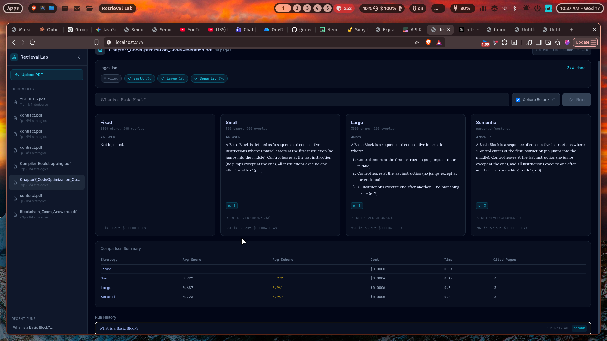
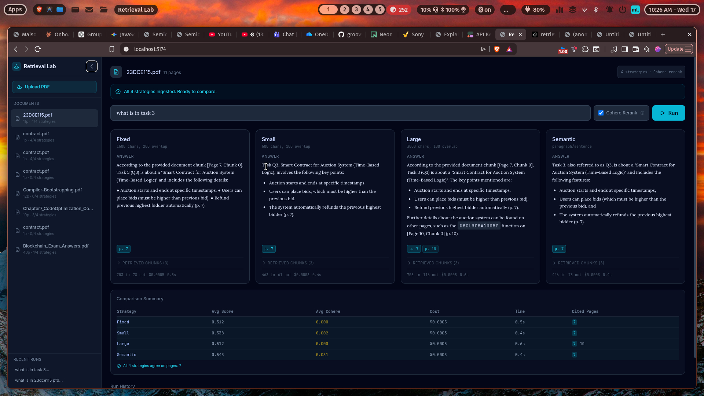
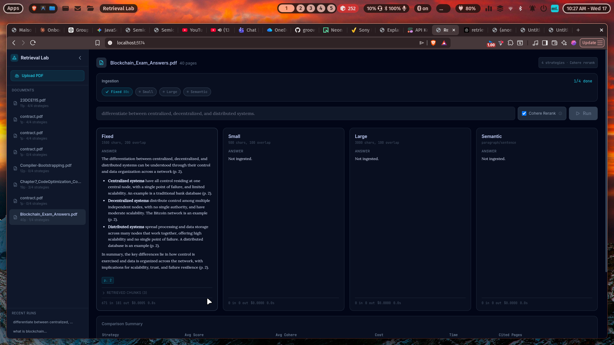

# Retrieval Lab

A side-by-side comparison tool for PDF retrieval quality across 4 chunking strategies, with optional Cohere reranking. Part of the **Day 12** project in the Groovy daily coding series.



## What It Does

Upload a PDF and instantly compare how 4 different text chunking strategies affect retrieval quality in a RAG pipeline. Ask a question and see answers, cited pages, similarity scores, and cost — all side by side.



## Tech Stack

| Layer | Technology |
|---|---|
| Frontend | React 19, Tailwind CSS, Vite |
| Backend | Node.js, Express |
| Database | PostgreSQL (Neon) via Prisma ORM + `@prisma/adapter-neon` |
| Vector DB | Pinecone (serverless, cosine similarity) |
| Embeddings | Google Gemini `gemini-embedding-001` (3072d) with Groq `nomic-embed-text-v1.5` (768d) fallback |
| LLM | Groq `llama-3.3-70b-versatile` |
| Reranking | Cohere `rerank-english-v3.0` (optional) |

## How It Works

### Upload & Auto-Ingest

1. Upload a PDF (drag-and-drop or click)
2. Ingestion **starts automatically** — no second click needed
3. All 4 chunking strategies run sequentially with real-time progress:

| Strategy | Config | Description |
|---|---|---|
| **Fixed** | 1500 chars, 200 overlap | Standard fixed-size chunks (Day 11 baseline) |
| **Small** | 500 chars, 100 overlap | Smaller chunks for finer granularity |
| **Large** | 3000 chars, 100 overlap | Larger chunks for more context |
| **Semantic** | paragraph/sentence boundaries | Splits on natural text boundaries |

4. Each strategy's chunks are embedded and stored in its own Pinecone namespace
5. If Gemini rate-limits (429), automatically falls back to Groq embeddings
6. 15-second cooldown between strategies to respect rate limits

### Compare

1. Type a question and press Enter or click Run
2. Optionally enable **Cohere Reranking** — retrieves top-15 chunks, re-scores them, returns top-3
3. For each strategy:
   - Embed the query using the same provider (Gemini/Groq) that ingested that strategy
   - Query Pinecone for relevant chunks
   - Optionally rerank with Cohere
   - Generate answer with Groq LLM
4. Results displayed in a 4-column grid with answer, cited pages, chunks, and cost



## Setup

```bash
# Clone and install
cd Day-12/retrieval-lab

# Server
cd server
cp .env.example .env   # Add your API keys (see below)
npm install
npx prisma db push
node server.js          # http://localhost:3001

# Client (new terminal)
cd ../client
npm install
npx vite --port 5174    # http://localhost:5174
```

## Environment Variables

Create `server/.env`:

| Variable | Description |
|---|---|
| `DATABASE_URL` | PostgreSQL connection string (Neon pooled endpoint with `?sslmode=require`) |
| `GEMINI_API_KEY` | Google AI Studio API key for embeddings |
| `GROQ_API_KEY` | Groq API key for LLM answers + embedding fallback |
| `PINECONE_API_KEY` | Pinecone API key |
| `COHERE_API_KEY` | Cohere API key (optional, for reranking) |
| `PORT` | Server port (default: 3001) |

## API Endpoints

| Method | Route | Description |
|---|---|---|
| GET | `/api/documents` | List all documents with ingestion status |
| POST | `/api/documents/upload` | Upload PDF (stores buffer for auto-ingestion) |
| GET | `/api/documents/:id` | Get document details |
| POST | `/api/documents/:id/start-ingestion` | Start background ingestion (auto after upload) |
| GET | `/api/documents/:id/ingest-progress` | Real-time progress per strategy |
| GET | `/api/documents/:id/ingest-status` | Get completed ingestions |
| POST | `/api/documents/:id/ingest-all` | Ingest with file upload (legacy endpoint) |
| POST | `/api/documents/:id/compare` | Run comparison across strategies |
| GET | `/api/documents/:id/runs` | Get run history |

## Architecture

```
client/                          server/
├── src/                         ├── config/
│   ├── App.jsx                  │   └── db.js              # Prisma + Neon adapter
│   ├── services/api.js          ├── controllers/
│   └── index.css                │   ├── documentController.js
├── tailwind.config.js           │   └── labController.js
├── vite.config.js               ├── services/
└── index.html                   │   ├── chunkingService.js  # 4 strategies
                                 │   ├── embeddingService.js # Gemini + Groq fallback
                                 │   ├── pineconeService.js  # Dual indexes (3072d + 768d)
                                 │   ├── groqService.js      # LLM answer generation
                                 │   └── rerankService.js    # Cohere reranking
                                 ├── middleware/
                                 │   ├── upload.js           # Multer PDF upload
                                 │   └── errorHandler.js
                                 ├── routes/
                                 │   ├── documentRoutes.js
                                 │   └── labRoutes.js
                                 ├── prisma/schema.prisma
                                 └── server.js
```

### Key Design Decisions

- **Dual Pinecone indexes**: Gemini embeddings (3072d) go to `retrieval-lab`, Groq embeddings (768d) go to `retrieval-lab-groq`. Each ingestion records which provider was used, and queries route to the correct index.
- **Async ingestion**: `start-ingestion` returns immediately and processes in background. Frontend polls every 2s for progress.
- **Neon adapter**: Uses `@prisma/adapter-neon` to avoid PgBouncer prepared statement conflicts with Prisma 6.x.
- **Embedding fallback**: `getEmbeddingsWithFallback()` tries Gemini first, auto-switches to Groq on 429/503, ensuring every strategy completes.

## Database Schema

```prisma
model Document {
  id         Int         @id @default(autoincrement())
  filename   String      @db.VarChar(255)
  uploadedAt DateTime    @default(now())
  pageCount  Int
  ingestions Ingestion[]
  labRuns    LabRun[]
}

model Ingestion {
  id               Int      @id @default(autoincrement())
  documentId       Int
  strategy         String   @db.VarChar(50)    // fixed | small | large | semantic
  chunkCount       Int      @default(0)
  pineconeNamespace String
  provider         String   @default("gemini")  // gemini | groq
  ingestedAt       DateTime @default(now())
  @@unique([documentId, strategy])
}

model LabRun {
  id         Int      @id @default(autoincrement())
  documentId Int
  question   String   @db.Text
  rerankUsed Boolean  @default(false)
  results    Json     // Full comparison results
  createdAt  DateTime @default(now())
}
```

## Features

- **Auto-ingestion**: Upload triggers all 4 strategies automatically
- **Real-time progress**: Live % bar and per-strategy status chips
- **Embedding fallback**: Gemini → Groq ensures no strategy fails
- **4-column comparison**: Side-by-side answers, scores, costs, cited pages
- **Cohere reranking**: Optional second-pass for higher precision
- **Agreement detection**: Highlights when all 4 strategies cite the same pages
- **Run history**: Revisit past comparisons with one click
- **Collapsible sidebar**: Document list + recent runs
- **Dark mode**: Slate/frost/electric design system with Lora serif + JetBrains Mono
- **Responsive**: Cards stack vertically on narrow viewports

## Screenshots

### Comparison Results
All 4 strategies compared with Cohere reranking enabled. The summary table shows avg scores, costs, response times, and cited pages. Agreement on page 7 is highlighted across all strategies.


### Full View with Sidebar
Document list in sidebar shows page count and ingestion status (e.g. "11p - 4/4 strategies"). Recent runs are accessible from the bottom of the sidebar.


### Partial Ingestion Progress
During ingestion, progress chips show which strategies are done (green check), active (spinner), or pending. The progress bar and "1/4 done" counter update in real-time.


## Related Projects

- **Day 10** — `ask-my-notes`: Keyword-based PDF Q&A
- **Day 11** — `vector-qa`: PDF Q&A with Pinecone vector search (single strategy)
- **Day 12** — `retrieval-lab`: This project — 4-strategy comparison tool
