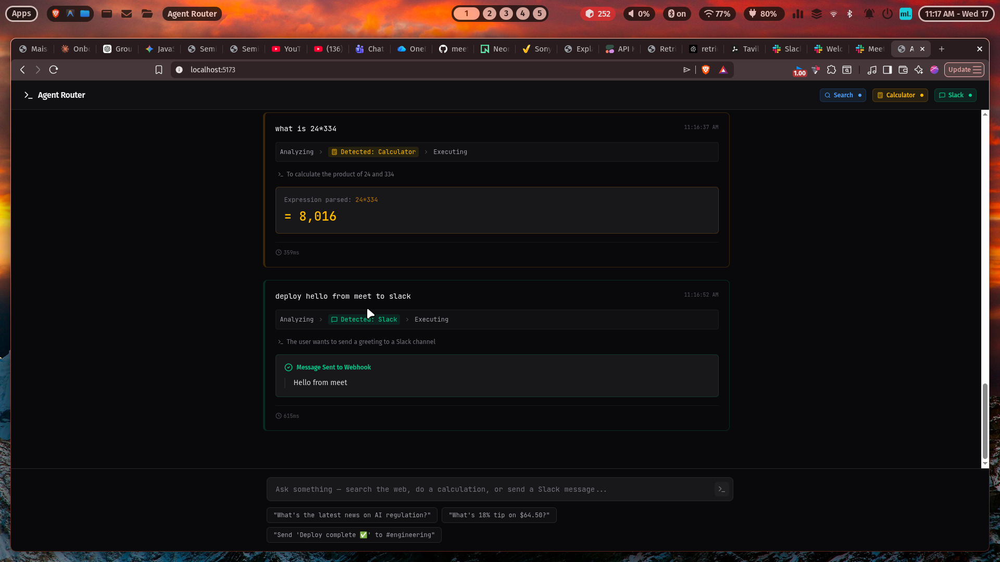

# Agent Router 🔀

Agent Router is a clean, developer-focused **Ops Console** that intelligently classifies user requests and automatically routes them to the right backend tool using **Groq (Llama 3.3 70B)**.

Unlike typical AI chatbots, Agent Router is designed like a CI/CD build log. When you enter a request, you visually see the trace progression (`Analyzing → Detected → Executing`) as the system parses your intent, extracts exact variables, and executes the specific API.

## 🌟 Core Features

- **High-Speed Routing**: Uses Groq's high-speed inference and JSON mode to parse user intent into structured tool calls instantly.
- **Server-Sent Events (SSE)**: The backend streams the routing process in real-time to the frontend.
- **Three distinct tools**:
  1. 🔍 **Web Search**: Integrates with the Tavily API to fetch current web snippets.
  2. 🧮 **Calculator**: Uses MathJS to safely evaluate arithmetic formulas passed in natural language.
  3. 💬 **Slack**: Triggers a webhook to instantly send messages to a Slack channel.
- **Monochromatic UI**: Built with React, TailwindCSS v4, and Lucide Icons. Features a dark `zinc-950` aesthetic with unique muted accent colors for each tool.

## 📸 Previews

### Web Search Integration


### Slack Integration


## 🏗️ Architecture

- **Frontend**: React (Vite), TailwindCSS v4
- **Backend**: Express.js
- **Router Logic**: `groq-sdk` with `llama-3.3-70b-versatile` running in strict `json_object` mode to prevent schema hallucinations.
- **APIs**: `@tavily/core`, `mathjs`, `axios`

## 🚀 How to Run

1. **Configure Environment Variables**
   Head into the `server` directory and fill out the `.env` file:
   ```env
   PORT=3001
   GROQ_API_KEY=your_groq_key
   TAVILY_API_KEY=your_tavily_key
   SLACK_WEBHOOK_URL=your_slack_webhook
   ```

2. **Start the Backend**
   ```bash
   cd server
   npm install
   npm run dev
   ```

3. **Start the Frontend**
   In a new terminal window:
   ```bash
   cd client
   npm install
   npm run dev
   ```

4. **Test it out**
   Open the localhost URL provided by Vite. Try the example chips at the bottom or type something like:
   * *"What is 15% of $120?"*
   * *"Send 'Deployment successful' to the engineering channel"*
   * *"What is the latest news on AI regulation?"*
