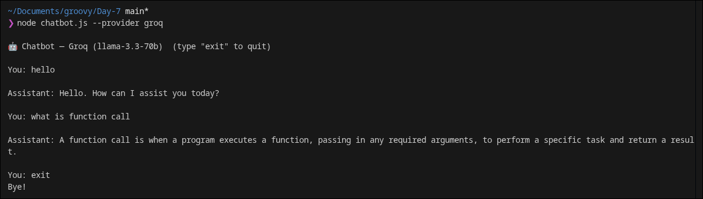
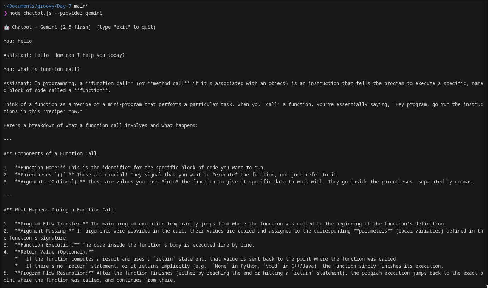
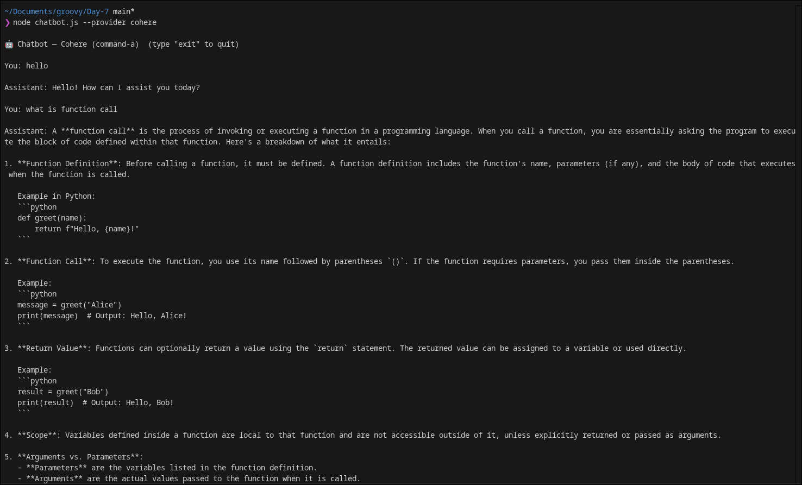

# Day 7 — Multi-Provider AI CLI & Chatbot

Refactored from the Day 6 single-provider Groq chatbot into a **provider-switchable CLI** that supports **Groq**, **Google Gemini**, and **Cohere** — all via a `--provider` flag.

---

## What's Inside

```
Day-7/
├── .env             ← API keys (never committed)
├── .env.example     ← Template — copy to .env and fill in keys
├── package.json     ← Node.js config (type: module)
├── chatbot.js       ← Interactive multi-turn chatbot (--provider flag)
└── node_modules/
```

---

## Prerequisites

- **Node.js** v18+
- API keys for all 3 providers:

| Provider | Get Key |
|---|---|
| Groq | [console.groq.com](https://console.groq.com) |
| Google Gemini | [aistudio.google.com/apikey](https://aistudio.google.com/apikey) |
| Cohere | [dashboard.cohere.com/api-keys](https://dashboard.cohere.com/api-keys) |

---

## Environment Setup

Copy the example file and fill in your keys:
```bash
cp .env.example .env
```

```env
GROQ_API_KEY=your_groq_api_key_here
GEMINI_API_KEY=your_gemini_api_key_here
COHERE_API_KEY=your_cohere_api_key_here
```

> `.env` is gitignored — your keys are never pushed to version control.

---

## Node.js Setup

```bash
npm install
```

Installs: `dotenv`

---

## Files

### 1. `cli.js` — Single-shot multi-provider CLI

Send one prompt to any provider and get a normalized response with token counts and response time.

**Run:**
```bash
node cli.js --provider groq       --prompt "What is the capital of France?"
node cli.js --provider gemini     --prompt "What is the capital of France?"
node cli.js --provider cohere     --prompt "What is the capital of France?"
```

**Output:**
```
──────────────────────────────────────────────────
Provider      : Groq (llama-3.3-70b-versatile)
Response Time : 302ms
Input Tokens  : 42
Output Tokens : 8
──────────────────────────────────────────────────

The capital of France is Paris.
```

---

### 2. `chatbot.js` — Interactive multi-turn chatbot

A terminal chatbot that maintains full conversation history across all turns. Choose your provider at startup.

**Run:**
```bash
node chatbot.js --provider groq
node chatbot.js --provider gemini
node chatbot.js --provider cohere
```

Type `exit` or press `Ctrl+C` to quit.

---

## Demo Screenshots

### Groq (llama-3.3-70b-versatile)



---

### Gemini (gemini-2.5-flash)



---

### Cohere (command-a-03-2025)



---

## Provider Details

| Provider | Endpoint | Auth | Model |
|---|---|---|---|
| **Groq** | `api.groq.com/openai/v1/chat/completions` | `Authorization: Bearer` | `llama-3.3-70b-versatile` |
| **Gemini** | `generativelanguage.googleapis.com/v1beta/...` | `?key=` query param | `gemini-2.5-flash` |
| **Cohere** | `api.cohere.com/v2/chat` | `Authorization: Bearer` | `command-a-03-2025` |

---

## How History Works

Every message is stored and sent to the API on each turn:

```
Turn 1 → [system, user1, assistant1]
Turn 2 → [system, user1, assistant1, user2, assistant2]
Turn 3 → [system, user1, assistant1, user2, assistant2, user3, assistant3]
```

The full array is sent every call — that's what gives the model memory.

---

## Key Concepts Covered

| Concept | Where |
|---|---|
| Multi-provider support | `cli.js`, `chatbot.js` |
| `--provider` flag parsing | Both files |
| Normalized output | `cli.js` → `{ provider, responseText, inputTokens, outputTokens, responseTimeMs }` |
| Conversation history | `chatbot.js` `history[]` array |
| Different API request shapes | Gemini uses `contents[]`, others use `messages[]` |
| Different response shapes | Gemini → `candidates[0]`, Cohere → `message.content[0].text` |
| Native `fetch` (no SDK) | Both files |
| Error handling | Both files — prints error, exits with code 1 |
